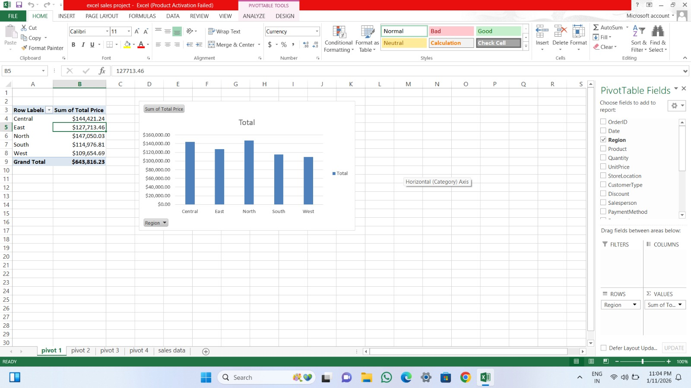
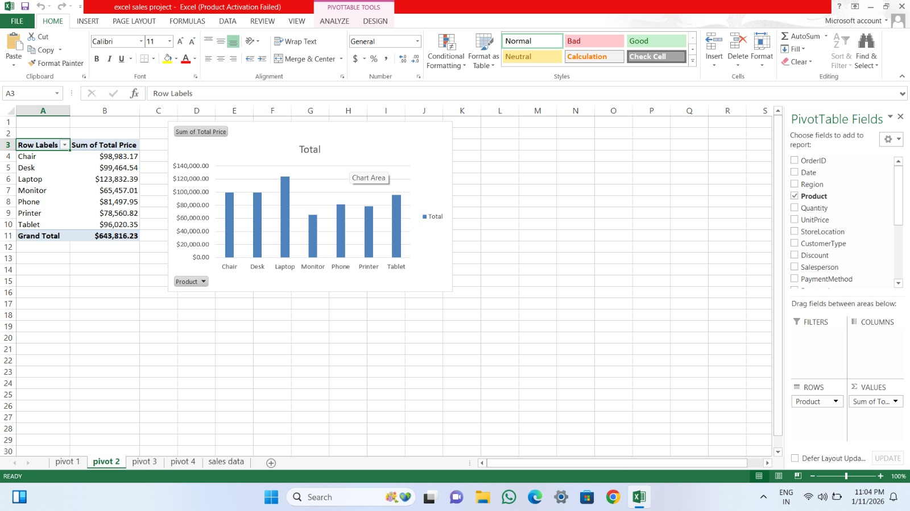
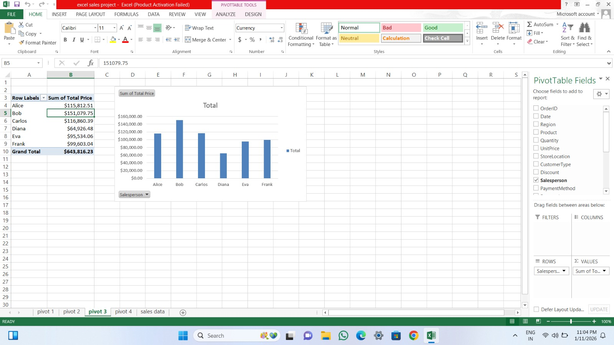

# Sales Performance Analysis Dashboard (Excel)

## 📌 Project Overview
This project demonstrates end-to-end Excel data analysis skills by building a **Sales Performance Dashboard** using real-world business data.  
The project focuses on **data cleaning, pivot table analysis, and dashboard creation** to derive meaningful insights for decision-making.

---
## 📂 Project Structure
excel-sales-dashboard/
- ├── Sales_Dashboard.xlsx
- ├── README.md
- └── screenshots/
    - ├── dashboard.jpeg
    - ├── pivot1.jpeg
    - ├── pivot2.jpeg
    - └── pivot3.jpeg
---

## 📊 Dataset Description
The dataset contains the following business-relevant columns:

- OrderID
- OrderDate, DeliveryDate
- Region, RegionManager, StoreLocation
- Product, Quantity, UnitPrice, Discount
- ShippingCost, TotalPrice
- Salesperson, CustomerName
- CustomerType, PaymentMethod
- Returned

---

## 🧹 Data Cleaning & Preparation
The following data cleaning steps were performed:

- Removed duplicate records using **OrderID**
- Handled missing values in:
  - Quantity
  - Discount
  - ShippingCost
- Standardized text columns using **TRIM**:
  - CustomerName
  - Salesperson
  - Product
  - StoreLocation
- Fixed data types for date and numeric fields
- Verified and recalculated **TotalPrice** where required

---

## 📈 Analysis Performed
Multiple Pivot Tables were created to analyze:

- **Total Sales by Region**
- **Product-wise Sales Performance**
- **Salesperson Performance**
- **Monthly Sales Trends**
- **Returned Orders Analysis**

These analyses help answer key business questions such as:
- Which region generates the highest revenue?
- Which products perform best?
- Who are the top-performing salespersons?
- How do sales trend over time?
- What is the return rate?

---

## 📊 Dashboard Features
A simple and interactive Excel dashboard was built with:

- **Column Chart**: Region vs Total Sales
- **Line Chart**: Monthly Sales Trend
- **Interactive Slicers** for:
  - Region
  - Product
  - Payment Method
  - Customer Type
  - Returned Orders

The dashboard allows dynamic filtering and quick insights.

---

## 📸 Project Screenshots

### 📈 Final Sales Dashboard

### 📊 Pivot Table – Sales by Region

### 📊 Pivot Table – Product & Salesperson Analysis

### 📊 Pivot Table – Monthly Sales Trend

---

## 🛠 Tools & Skills Used
- Microsoft Excel
- Data Cleaning Techniques
- Pivot Tables & Pivot Charts
- Slicers
- Dashboard Design
- Business Data Analysis

---

## 🎯 Key Learnings
- Cleaning and preparing real-world datasets
- Performing analytical summaries using Pivot Tables
- Designing professional dashboards in Excel
- Presenting insights visually for business users

---

## 📎 File Information
- **Sales_Dashboard.xlsx**  
  Contains the cleaned dataset, pivot tables, charts, and final dashboard.

---
